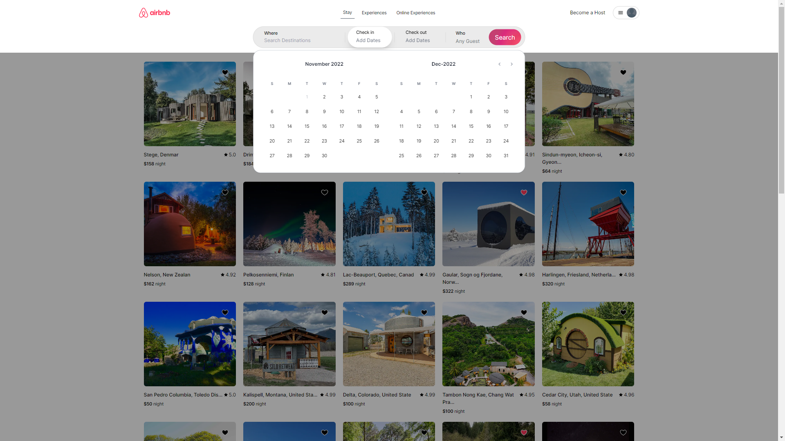
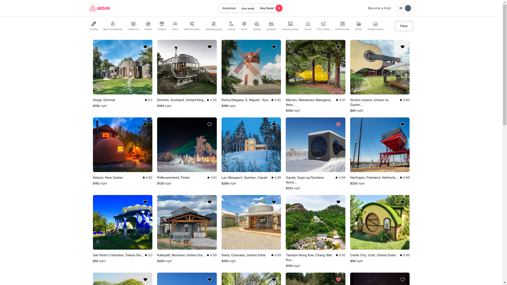
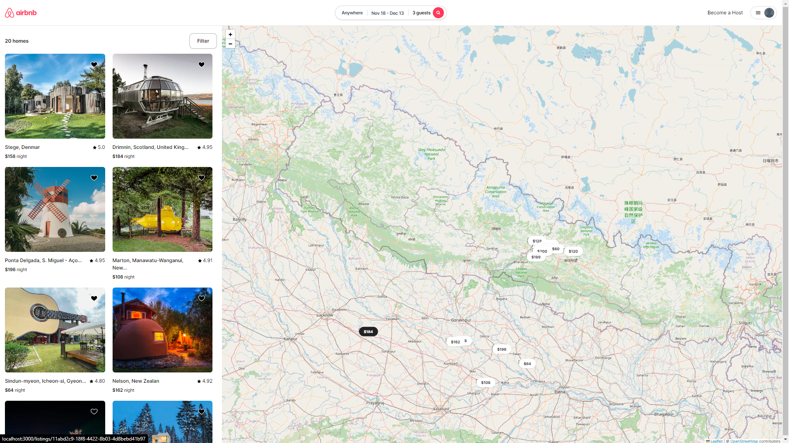
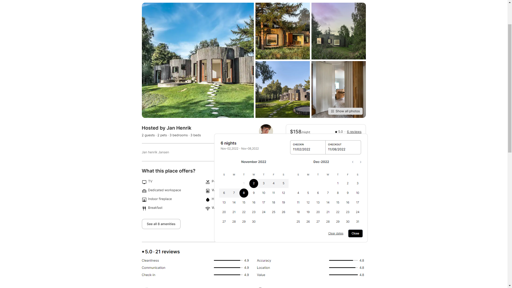
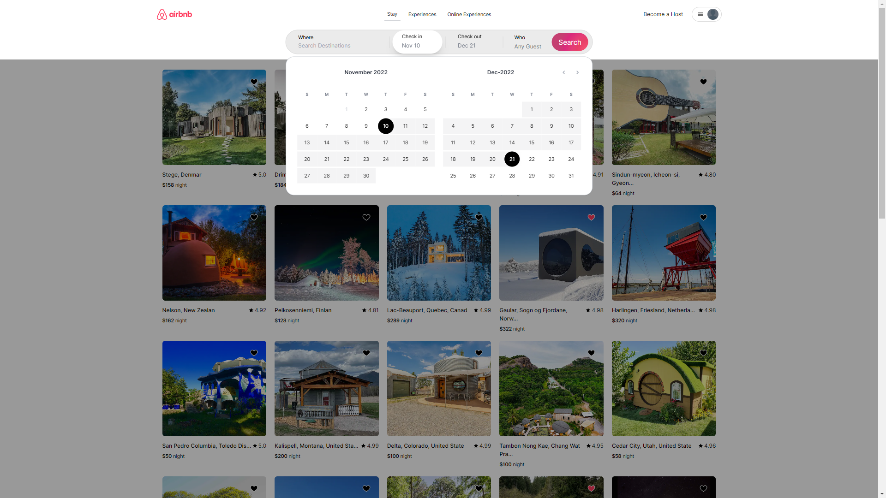
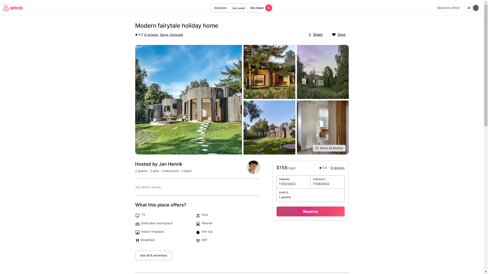
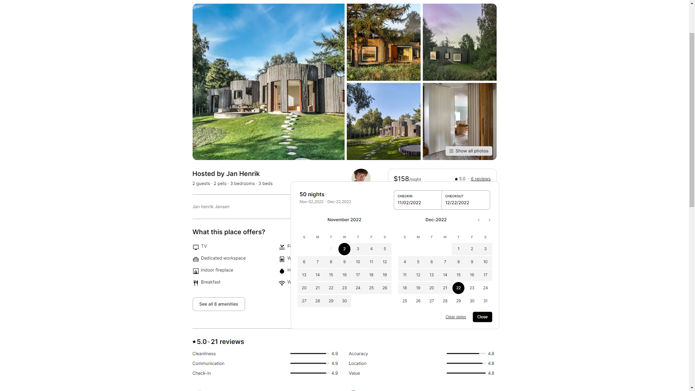
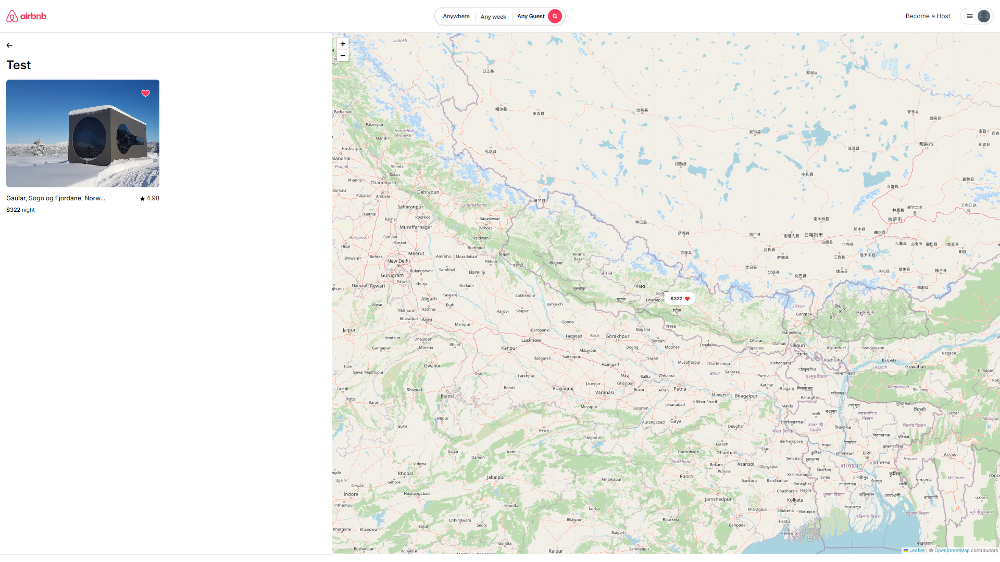

# Airbnb Clone using Reactjs

This is airbnb clone using reactjs which has many features. I have not added backend yet.

# Features:

- Custom Date Picker (With animation)
- Custom Guest Picker
- Shows listings according to visible map in map page
- Highlight the listing like in [airbnb](https://airbnb.com)
- Exact Header Animations of Aribnb website
- Add/Remove Bookmarks with folder
- Original Data extracted from airbnb.com using a custom web scrapper bot

## Video of the Project

You can view the project video from [Here](https://github.com/ujen5173/airbnb-clone/blob/main/public/project_images/video.mkv) or go to `public/project_images/video.mkv`

## Images of the Project

